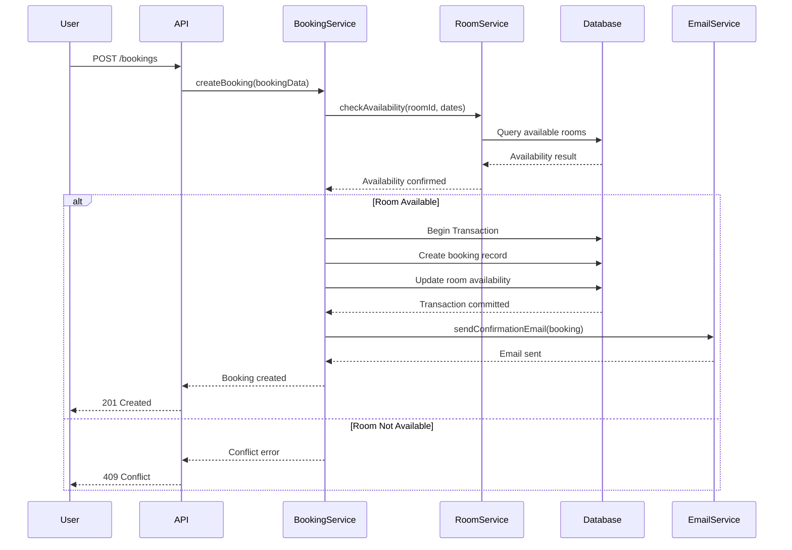
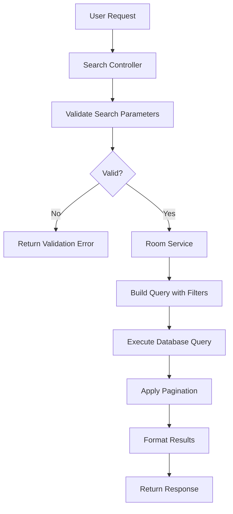
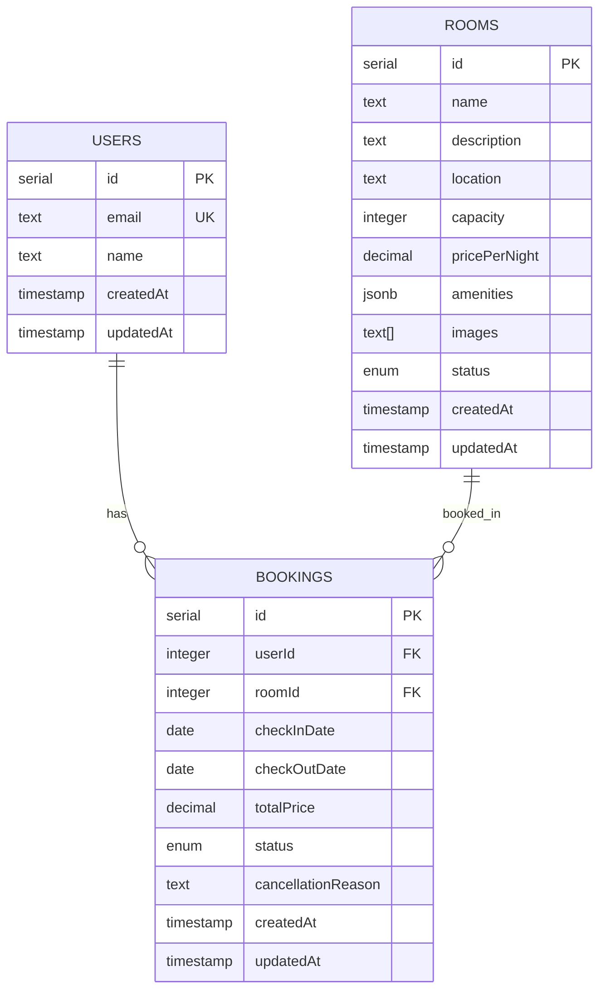
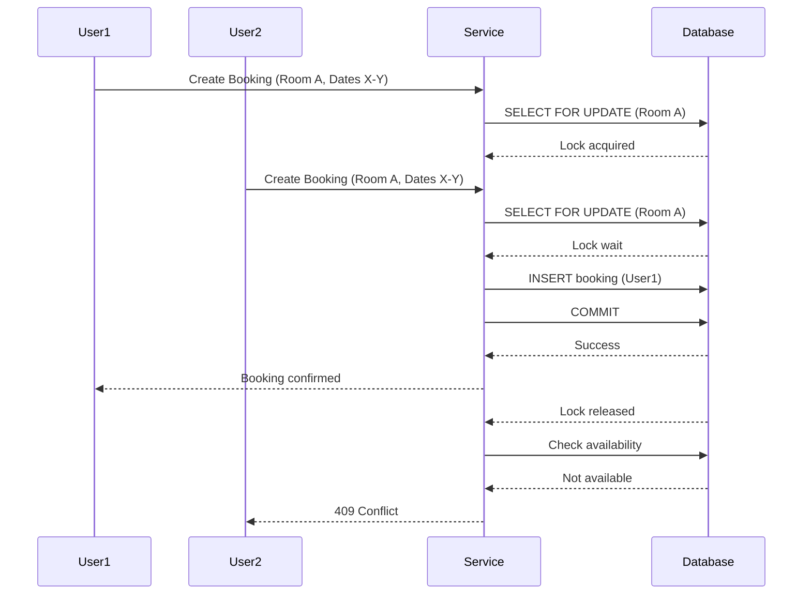

# Booka - System Architecture & Business Logic

This document provides comprehensive documentation of the Booka Room Booking Platform's business logic, system architecture, and design decisions. It serves as a reference for both AI agents and developers working on the system.

## Table of Contents

1. [Business Logic & Requirements](#business-logic--requirements)
2. [System Architecture](#system-architecture)
3. [Data Models](#data-models)
4. [API Design](#api-design)
5. [Scalability & Reliability](#scalability--reliability)
6. [Security Considerations](#security-considerations)
7. [Email Service](#email-service)
8. [Database Design](#database-design)

## Business Logic & Requirements

### Core Features

#### User Registration and Authentication
- Users can register with email and password
- Email must be unique across the system
- Password must meet security requirements
- Upon registration, users receive a welcome email
- Users can authenticate using email/password credentials
- JWT tokens are used for session management

#### Room Search
- Users can search for available rooms with multiple filters:
  - **Date Range**: Check-in and check-out dates
  - **Location**: City, region, or specific address
  - **Capacity**: Number of guests
  - **Amenities**: WiFi, parking, air conditioning, etc.
  - **Price Range**: Minimum and maximum price per night
- Search results are paginated
- Results show availability status in real-time
- Search results include room images, descriptions, and ratings

#### Room Booking
- Users can book available rooms
- Booking process includes:
  1. Availability check for requested dates
  2. Payment processing (integration point)
  3. Booking confirmation
  4. Confirmation email sent to user
- Bookings are subject to cancellation policies
- Overlapping bookings are prevented through database constraints
- Booking statuses: `pending`, `confirmed`, `cancelled`, `completed`

#### Booking Cancellation
- Users can cancel their own bookings
- Cancellation policies apply (refund rules based on timing)
- Cancellation triggers:
  - Status update in database
  - Cancellation email notification
  - Potential refund processing (integration point)

#### Booking History Retrieval
- Users can retrieve their complete booking history
- History includes:
  - All bookings (past, present, future)
  - Booking status
  - Room details
  - Dates and pricing
  - Cancellation information
- Results are paginated and sortable
- Filtering by date range and status

#### Confirmation Email Notifications
- Automated emails sent for:
  - Booking confirmation
  - Booking cancellation
- Emails are sent synchronously (can be made async in future iterations)
- Email delivery failures are logged

## System Architecture

### Technology Stack

- **Framework**: NestJS 10.3.0 - Modular, scalable Node.js framework
- **Database**: PostgreSQL 16 - Relational database with ACID compliance
- **ORM**: Drizzle ORM 0.29.0 - Type-safe SQL query builder
- **Validation**: Zod 3.22.4 - Schema validation library
- **Runtime**: Node.js 20 - JavaScript runtime

### Architecture Patterns

#### Modular Design
The application follows a feature-based module structure:

```
src/
├── auth/              # Authentication module
├── users/             # User management module
├── rooms/             # Room management module
├── bookings/          # Booking management module
├── emails/            # Email service module
├── database/          # Database configuration
└── common/            # Shared utilities
```

Each module contains:
- **Controller**: Handles HTTP requests/responses
- **Service**: Contains business logic
- **DTOs**: Data Transfer Objects with Zod validation
- **Module**: NestJS module definition

#### Service Layer Architecture
- Controllers are thin and delegate to services
- Services contain all business logic
- Services are testable and reusable
- Dependency injection is used throughout

#### Repository Pattern Considerations
- Drizzle ORM provides type-safe queries
- Database operations are abstracted in service layer
- Transactions are handled at the service level
- Repository pattern can be introduced if needed for complex queries

### System Flow Diagrams

#### Booking Flow



#### Search Flow



## Data Models

### Users Table
Located in `src/database/schema.ts`:

```typescript
users {
  id: serial (primary key)
  email: text (unique, not null)
  name: text (not null)
  createdAt: timestamp
  updatedAt: timestamp
}
```

### Rooms Table (To be implemented)
```typescript
rooms {
  id: serial (primary key)
  name: text (not null)
  description: text
  location: text (not null)
  capacity: integer (not null)
  pricePerNight: decimal (not null)
  amenities: jsonb
  images: text[]
  status: enum ('available', 'unavailable')
  createdAt: timestamp
  updatedAt: timestamp
}
```

### Bookings Table (To be implemented)
```typescript
bookings {
  id: serial (primary key)
  userId: integer (foreign key -> users.id)
  roomId: integer (foreign key -> rooms.id)
  checkInDate: date (not null)
  checkOutDate: date (not null)
  totalPrice: decimal (not null)
  status: enum ('pending', 'confirmed', 'cancelled', 'completed')
  cancellationReason: text
  createdAt: timestamp
  updatedAt: timestamp
  
  Constraints:
  - Unique constraint on (roomId, checkInDate, checkOutDate) where status != 'cancelled'
  - Check constraint: checkOutDate > checkInDate
}
```

### Relationships



## API Design

### RESTful API Structure

#### Base URL
```
/api/v1
```

#### Endpoint Patterns

**Authentication**
- `POST /api/v1/auth/register` - Register new user
- `POST /api/v1/auth/login` - User login
- `POST /api/v1/auth/logout` - User logout
- `POST /api/v1/auth/refresh` - Refresh access token

**Rooms**
- `GET /api/v1/rooms` - Search rooms (query parameters: dateFrom, dateTo, location, capacity, amenities, minPrice, maxPrice, page, limit)
- `GET /api/v1/rooms/:id` - Get room details
- `GET /api/v1/rooms/:id/availability` - Check room availability for date range

**Bookings**
- `POST /api/v1/bookings` - Create new booking
- `GET /api/v1/bookings` - Get user's booking history (query parameters: status, dateFrom, dateTo, page, limit)
- `GET /api/v1/bookings/:id` - Get booking details
- `PATCH /api/v1/bookings/:id/cancel` - Cancel booking

### Request/Response Formats

#### Request Validation
All requests are validated using Zod schemas through DTOs:

```typescript
// Example: Create Booking DTO
{
  roomId: number (required)
  checkInDate: string (ISO date, required)
  checkOutDate: string (ISO date, required)
}
```

#### Response Format

**Success Response (200/201)**
```json
{
  "success": true,
  "data": { ... },
  "message": "Operation successful"
}
```

**Error Response (4xx/5xx)**
```json
{
  "success": false,
  "error": {
    "code": "ERROR_CODE",
    "message": "Human-readable error message",
    "details": { ... }
  }
}
```

#### Pagination Format
```json
{
  "data": [...],
  "pagination": {
    "page": 1,
    "limit": 20,
    "total": 100,
    "totalPages": 5
  }
}
```

### Error Handling

Standard HTTP status codes:
- `200 OK` - Successful GET/PUT request
- `201 Created` - Successful POST request
- `400 Bad Request` - Validation error
- `401 Unauthorized` - Authentication required
- `403 Forbidden` - Insufficient permissions
- `404 Not Found` - Resource not found
- `409 Conflict` - Resource conflict (e.g., room already booked)
- `429 Too Many Requests` - Rate limit exceeded
- `500 Internal Server Error` - Server error

### API Documentation with Swagger

**REQUIREMENT**: All endpoints MUST have Swagger/OpenAPI documentation.

#### Swagger Configuration
- **Access URL**: `http://localhost:{PORT}/api` (default: `http://localhost:3000/api`)
- **Framework**: NestJS Swagger Module (`@nestjs/swagger`)
- **UI**: Swagger UI (via `swagger-ui-express`)

#### Swagger Setup Requirements

1. **All Controllers**:
   - MUST use `@ApiTags()` decorator to group endpoints
   - MUST use `@ApiOperation()` for each endpoint with summary and description
   - MUST use `@ApiResponse()` to document all possible response codes
   - MUST use `@ApiParam()` for path parameters
   - MUST use `@ApiQuery()` for query parameters
   - MUST use `@ApiBody()` for request bodies (when applicable)

2. **Authentication Endpoints**:
   - MUST use `@ApiBearerAuth('JWT-auth')` for protected endpoints
   - MUST document authentication requirements in Swagger

3. **DTOs**:
   - MUST use `@ApiProperty()` decorators on all DTO properties
   - MUST include descriptions, examples, and validation constraints
   - MUST document required vs optional fields

4. **Response Schemas**:
   - MUST define response schemas using `@ApiResponse()` with schema definitions
   - MUST document success and error response formats
   - MUST include examples for clarity

#### Swagger Decorator Examples

**Controller Example**:
```typescript
@ApiTags('bookings')
@Controller('bookings')
@ApiBearerAuth('JWT-auth')
export class BookingsController {
  @Post()
  @ApiOperation({ summary: 'Create a new booking' })
  @ApiResponse({ status: 201, description: 'Booking created successfully' })
  @ApiResponse({ status: 400, description: 'Validation error' })
  @ApiResponse({ status: 409, description: 'Room not available' })
  createBooking(@Body() dto: CreateBookingDto) { ... }
}
```

**DTO Example**:
```typescript
export class CreateBookingDto {
  @ApiProperty({ description: 'Room ID', example: 1 })
  roomId: number;

  @ApiProperty({ description: 'Check-in date', example: '2024-01-15' })
  checkInDate: string;

  @ApiProperty({ description: 'Check-out date', example: '2024-01-20' })
  checkOutDate: string;
}
```

#### Swagger Best Practices

- **Always document**: Every endpoint must be fully documented in Swagger
- **Use tags**: Group related endpoints using `@ApiTags()`
- **Provide examples**: Include realistic examples in `@ApiProperty()` decorators
- **Document errors**: Document all possible error responses with `@ApiResponse()`
- **Authentication**: Clearly mark protected endpoints with `@ApiBearerAuth()`
- **Keep updated**: Swagger documentation must be kept in sync with code changes
- **Test in Swagger UI**: Use Swagger UI to test endpoints during development

#### Swagger UI Features

- **Interactive Testing**: Test all endpoints directly from Swagger UI
- **Authentication**: JWT tokens can be entered and persisted for testing
- **Schema Validation**: Request/response schemas are automatically validated
- **Try It Out**: All endpoints support "Try it out" functionality

## Scalability & Reliability

### Rate Limiting

**Strategy**: Simple in-memory rate limiting
- **Implementation**: NestJS Throttler module (in-memory storage)
- **Limits**:
  - Public endpoints: 100 requests per minute per IP
  - Authenticated endpoints: 500 requests per minute per user
  - Search endpoints: 50 requests per minute per IP
- **Note**: For distributed deployments, Redis-based rate limiting can be added in future iterations
- **Headers**: Include rate limit info in response headers

### Multi-Region Deployment

**Future Enhancement**: Multi-region deployment is planned for future iterations when the application scales. Current implementation focuses on single-region deployment with:
- Single PostgreSQL database instance
- Stateless JWT tokens (enables horizontal scaling within a region)
- Health check endpoints for load balancer integration

### Data Consistency

#### Transaction Management
- All booking operations use database transactions
- Transactions ensure atomicity of:
  - Booking creation
  - Availability updates
  - Payment processing (if synchronous)

#### Concurrency Control
- **Pessimistic Locking**: Row-level locks for critical booking operations using `SELECT FOR UPDATE`
- **Database Constraints**: Unique constraints prevent double-booking
- **Transaction Isolation**: Use appropriate transaction isolation levels to prevent race conditions

**Booking Concurrency Flow**:


#### Database Constraints
- Foreign key constraints ensure referential integrity
- Unique constraints prevent duplicate bookings
- Check constraints validate date ranges
- Not null constraints ensure data completeness

### Fault Tolerance

#### Error Handling Strategies
- **Graceful Error Responses**: Return appropriate HTTP status codes and error messages
- **Input Validation**: Validate all inputs to prevent invalid data from causing errors
- **Database Error Handling**: Handle database errors gracefully with user-friendly messages

#### Retry Mechanisms
- **Database Operations**: Retry transient connection errors (3 attempts with simple backoff)
- **Email Service**: Basic retry for failed email sends (3 attempts)
- **Note**: Advanced retry mechanisms and circuit breakers can be added in future iterations

#### Health Checks
Existing `HealthModule` provides:
- `GET /health` - Basic health check
- Returns: status, timestamp, uptime

**Extended Health Checks** (Future enhancement):
- Database connectivity check
- Email service status check

## Security Considerations

### Authentication
- **JWT Tokens**: Stateless authentication
- **Token Expiration**: Access tokens (15 minutes), Refresh tokens (7 days)
- **Password Hashing**: bcrypt with salt rounds (12)
- **Token Storage**: HTTP-only cookies for refresh tokens (recommended)

### Authorization
- **Role-Based Access Control (RBAC)**: 
  - `user` - Standard user permissions
  - `admin` - Administrative permissions (future)
- **Resource Ownership**: Users can only access their own bookings
- **Middleware**: Authentication and authorization guards on protected routes

### Data Protection
- **Input Sanitization**: All user inputs are validated and sanitized
- **SQL Injection Prevention**: Parameterized queries via Drizzle ORM
- **XSS Prevention**: Input validation and output encoding
- **CSRF Protection**: CSRF tokens for state-changing operations
- **Data Encryption**: Sensitive data encrypted at rest
- **HTTPS**: All communications over TLS in production

## Email Service

### Confirmation Emails

#### Email Service Integration
- **Provider**: Configurable (SendGrid, AWS SES, Nodemailer, etc.)
- **Processing**: Emails sent synchronously (non-blocking where possible)
- **Retry Logic**: Basic retry for failed email sends (3 attempts)
- **Logging**: Log all email send attempts and failures

#### Email Templates

**Booking Confirmation**:
- Subject: "Booking Confirmation - [Room Name]"
- Content: Booking details, dates, price, cancellation policy

**Booking Cancellation**:
- Subject: "Booking Cancelled - [Room Name]"
- Content: Cancellation confirmation, refund information

**Note**: Async email processing with message queues can be implemented in future iterations for better scalability

## Database Design

### Schema Design

See [Data Models](#data-models) section for table structures.

### Indexes

**Performance Optimization**:
- `users.email` - Unique index (already enforced by unique constraint)
- `rooms.location` - Index for location-based searches
- `rooms.status` - Index for filtering available rooms
- `bookings.userId` - Index for user booking history queries
- `bookings.roomId` - Index for room booking queries
- `bookings.checkInDate, bookings.checkOutDate` - Composite index for availability checks
- `bookings.status` - Index for status filtering

### Migrations

Using Drizzle Kit (configured in `drizzle.config.ts`):
- **Generate Migrations**: `npm run db:generate`
- **Run Migrations**: `npm run db:migrate`
- **Migration Files**: Stored in `src/database/migrations/`
- **Version Control**: All migrations are version controlled
- **Rollback**: Support for migration rollback (to be implemented)

### Query Optimization

- **Connection Pooling**: Configured in Drizzle module
- **Eager Loading**: Avoid N+1 queries with proper joins
- **Pagination**: Always use pagination for list endpoints
- **Selective Fields**: Only select required fields from database
- **Note**: Query caching with Redis can be added in future iterations for improved performance

## Development Guidelines

### Code Organization
- Feature-based modules in `src/`
- Shared utilities in `src/common/`
- Database schema in `src/database/schema.ts`
- Configuration in `src/config/`

### API Documentation Standards

**CRITICAL**: All API endpoints MUST be documented in Swagger. When creating new endpoints:

1. Add `@ApiTags()` to the controller class
2. Add `@ApiOperation()` to each endpoint method
3. Add `@ApiResponse()` for all possible response codes
4. Add `@ApiProperty()` to all DTO properties
5. Use `@ApiBearerAuth()` for protected endpoints
6. Test the endpoint in Swagger UI to ensure documentation is accurate

Swagger documentation is available at `/api` endpoint and must be kept up-to-date with all code changes.

### Testing Strategy
- **Unit Tests**: Test individual services and utilities
- **Integration Tests**: Test API endpoints with mock data
- **Test Coverage**: Aim for coverage of endpoints and business logic

### Monitoring & Observability
- **Logging**: Basic structured logging (can be enhanced with correlation IDs in future)
- **Error Tracking**: Log errors with context for debugging
- **Note**: Advanced monitoring, metrics, and alerting can be added in future iterations

## Future Enhancements

- **Multi-Region Deployment**: Support for distributed deployment across multiple regions
- **Redis Integration**: Add Redis for distributed rate limiting, caching, and session management
- **Circuit Breakers**: Add circuit breaker pattern for external service calls
- **Advanced Monitoring**: Implement comprehensive monitoring, metrics, and alerting
- **Payment Gateway Integration**: Integrate payment processing
- **Analytics**: Reporting and analytics endpoints

